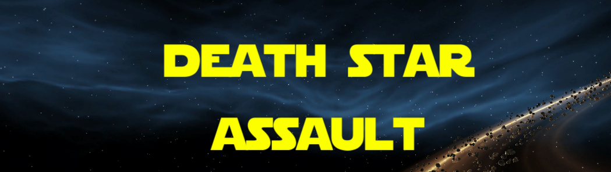

<h1 align="center">
  
</h1>

**- [Click here for English version.](README_EN.md)**
 
 

Proyecto realizado como práctica con el motor Unity inspirado en las batallas espaciales de la saga Star Wars.

Soy el autor de la programación. Los assets gráficos (modelos 3D y Skybox) y la música no son de mi propiedad.

Este juego no se distribuye de forma comercial.

## Compilación del proyecto

El proyecto se ha creado utilizando la versión 2021.3.5f1 de Unity.

Simplemente clona el repositorio o copia los archivos contenidos en él y abre el proyecto con Unity. Los recursos necesarios se instalarán automáticamente.

Una vez dentro del editor de Unity, se podrá modificar y compilar el proyecto.

## Instrucciones del juego

Para moverte a través de los menú, puedes utilizar el ratón.

Utiliza las teclas WASD para mover la nave, el ratón para mover la cámara y el botón izquierdo para disparar. Con el botón derecho del ratón puedes alternar entre los dos modos de disparo.

En el modo Alianza deberás eliminar a todas las naves del escenario antes de poder destruir la Estrella de la Muerte.

En el modo Imperio deberás eliminar a todas las naves que intentan destruir la Estrella de la Muerte.

## Descarga del juego

Actualmente, esta versión del juego puede descargarse de los siguientes sitios.

<a href="https://sergiomejias.itch.io/death-star-assault">
<a href="https://gamejolt.com/games/death-star-assault/738532">